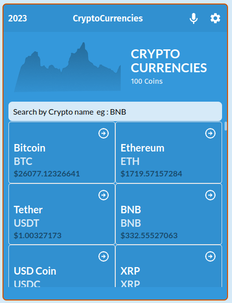
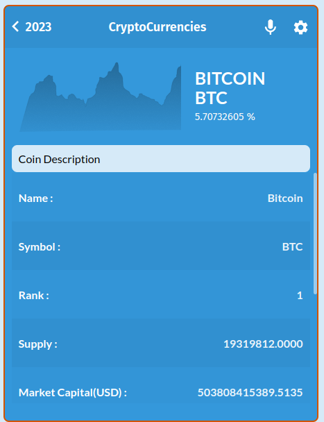

  
   

  <h3><b>Metrics WebApp</b></h3>

<!-- TABLE OF CONTENTS -->

# 📗 Table of Contents

- [📖 About the Project](#about-project)
  - [App Screenshots](#screenshots)
  - [🛠 Built With](#built-with)
    - [Tech Stack](#tech-stack)
    - [Key Features](#key-features)
  - [🚀 Live and Video Demo](#live-demo)
- [💻 Getting Started](#getting-started)
  - [Setup](#setup)
  - [Prerequisites](#prerequisites)
  - [Install](#install)
  - [Usage](#usage)
  - [Run tests](#run-tests)
  - [Deployment](#triangular_flag_on_post-deployment)
- [👥 Authors](#authors)
- [🤝 Contributing](#contributing)
- [⭐️ Show your support](#support)
- [🙏 Acknowledgements](#acknowledgements)
- [❓ FAQ](#faq)
- [📝 License](#license)

<!-- PROJECT DESCRIPTION -->

# 📖 [Metrics WebApp] 

> This is a metrics webapp demo for digital currency. Users can get information about a related crypto coin

**[Metrics WebApp]** This is a metrics webapp demo for digital currency. Users can get information about a related crypto coin

# [Screenshots] 

## 🛠 Built With 

- Technologies/Tools used:
| `create-react-app tool`
| `Webpack(Code Bundlng et al)`
| `Babel (code transpiling)`
| `Jest(for testing)`
| `Git(version control)`
| `ESLint(JavaScript linting)`
| `Stylelint(style linting)`

### Tech Stack 

- Major Languages (HTML, CSS, JavaScript)
- Framework/Libraries (React, Redux)

  
Client

  <ul>
    <li><a href="https://reactjs.org/">React.js</a></li>
  </ul>

  
Server

  <ul>
    <li><a href="https://expressjs.com/">Express.js</a></li>
  </ul>

Database

  <ul>
    <li><a href="https://www.postgresql.org/">PostgreSQL</a></li>
  </ul>

<!-- Features -->

### Key Features 

- **[Home Page Displaying All Coins]**
- **[Details Page Displaying Details Of a Selected Coin]**

(<a href="#readme-top">back to top</a>)

<!-- LIVE DEMO -->

## 🚀 Live Demo and Video Demo 

- [Live Demo Link](https://cryptocurrency-coins-react.netlify.app/)

- [Video Demo Link](https://www.loom.com/share/9985a180f7ab479fb956106af4a421cc)

(<a href="#readme-top">back to top</a>)

<!-- GETTING STARTED -->

## 💻 Getting Started 

To get a local copy up and running follow these simple example steps.

### Prerequisites
- A text editor(preferably Visual Studio Code) or any of your choice

### Setup

### Install
- Git
- Node
- Text editor preferably VScode

## Usage
### Clone this repository
> $ git clone https://github.com/tashisrael/react-metrics-webapp.git:
> $ cd react-metrics-webapp

## Run project
### `$ npm install`
Installs the modules and dependancies required to start the project

### `npm start`
Runs the app in the development mode.\
Open [http://localhost:3000](http://localhost:3000) to view it in your browser.

## Run tests
### `npm run test`
> Launches the test runner in the interactive watch mode.\
See the section about [running tests](https://facebook.github.io/create-react-app/docs/running-tests) for more information.

## 💻 Author 

👤 **Daniel Matama**

- GitHub: [@githubhandle](https://github.com/danielmatama)
- Twitter: [@twitterhandle](https://twitter.com/danmatama)
- Linkedin: [@linkedinhandle](https://www.linkedin.com/in/daniel-matama-mwebesa/

(<a href="#readme-top">back to top</a>)

<!-- CONTRIBUTING -->

## 🤝 Contributing 

Contributions, issues, and feature requests are welcome!

Feel free to check the [issues page](../../issues/).

(<a href="#readme-top">back to top</a>)

<!-- SUPPORT -->

## ⭐️ Show your support 

> Write a message to encourage readers to support your project

If you like this project...

(<a href="#readme-top">back to top</a>)

<!-- ACKNOWLEDGEMENTS -->

## 🙏 Acknowledgments 

- Microverse code reviewers for there guidance
- Data from [CoinCap](https://docs.coincap.io/)
- Design idea by [Nelson Sakwa on Behance](https://www.behance.net/sakwadesignstudio)

(<a href="#readme-top">back to top</a>)

<!-- LICENSE -->

## 📝 License 

This project is [MIT](./LICENSE) licensed.

_NOTE: we recommend using the [MIT license](https://choosealicense.com/licenses/mit/) - you can set it up quickly by [using templates available on GitHub](https://docs.github.com/en/communities/setting-up-your-project-for-healthy-contributions/adding-a-license-to-a-repository). You can also use [any other license](https://choosealicense.com/licenses/) if you wish._

(<a href="#readme-top">back to top</a>)

